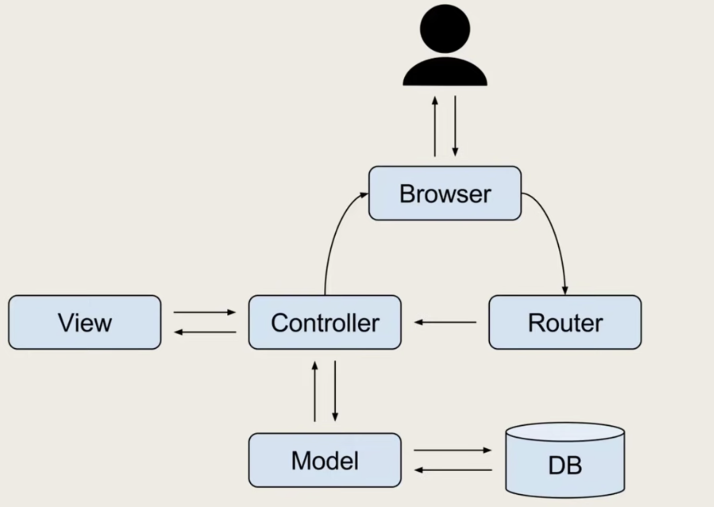

# 1. MVC
Created Tuesday 14 December 2021

Short for Model View Controller.

#### Why
Separation Of Concerns.


#### How

* Just create 3 component apps, that are blind to each other. 
* These 3 components have a fixed inputs and outputs, i.e. rigid interface.
* This "fixedness" of inputs and outputs allows for abstraction in the whole app, i.e. one can change one component without having any effect on the other two.


Advantages of MVC:

* Easy to test and debug. View can be substituted for a text-based interpreter, and no change is needed. Views may be tested using dummy data based on object schemas.
* Very low impact of change among MVC.


#### What
View (generate pages from data):

* Input: An object with data.
* Output: A page with data inserted in it. Ready for inflation/rendering.


* Model (talk to DB, check/process stuff according to business logic).
	* Input: A request object, containing payload from user. To be processed according to business logic, data may be persisted.
	* Output: A response object, containing responses and/or status codes.
* Controller (handles browser stuff + call View, Model)
	* View facing:
		* Output: Data ready for page generation functions.
		* Input: Generated page.
	* Model facing:
		* Output: Pure argument object.
		* Input: Pure output object.
	* Input: request object with chosen route.
	* Output: Generated page with network details.


Note: 

* Router is different from Controller, so the **Controller knows the decided route.**
* FMTC - Fat Model Thin Controller is the goal. Controller should preferably represent 4 function calls, nested within each other, like so.


```
function App(request, route) // abstracting an MVC app as a function
{
cleanedRequest = Controller.cleanRequest(request); // clean request for the Model
responseData = Model.process(request, route);
// change/groom responseData into a form acceptable by View - this step should be purely syntactic, as much as possible.
groomedResponseData = Controller.groomForView(responseData);
generatedPage = View.generatePage(goomedResponseData, route);
return generatedPage;
	
// or, simply 4 nested calls
return View.generatePage(Controller.groomForView(Model.process(Controller.cleanRequest(request), route)), route);
}
```

